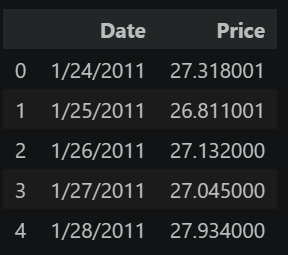
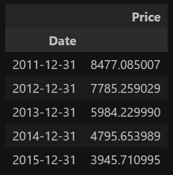
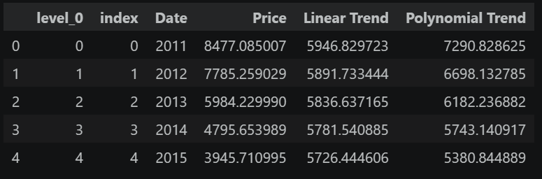
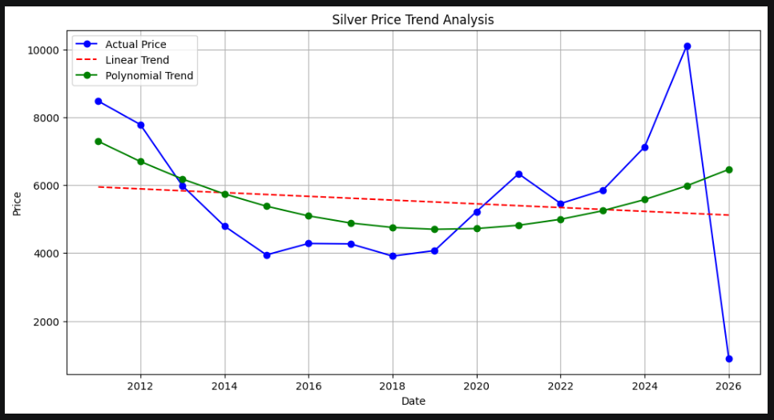

# Ex.No: 02 LINEAR AND POLYNOMIAL TREND ESTIMATION
Date:27.04.2026

# AIM:
To Implement Linear and Polynomial Trend Estiamtion Using Python.

# ALGORITHM:
1. Import necessary libraries (NumPy, Matplotlib)

2. Load the dataset

3. Calculate the linear trend values using least square method

4. Calculate the polynomial trend values using least square method

# PROGRAM:

```python
import pandas as pd
import numpy as np
import matplotlib.pyplot as plt
df = pd.read_csv("silver_prices_data.csv")
df.head()
df['Date'] = pd.to_datetime(df['Date'])
df = df.set_index('Date')
df.head()
resampled_data = df['Price'].resample('Y').sum().to_frame()
resampled_data.head()
resampled_data.index = resampled_data.index.year
resampled_data.reset_index(inplace=True)
resampled_data.head()
date = resampled_data['Date'].tolist()
resampled_data['Date'] = date
price = resampled_data['Price'].tolist()
X = [i - date[len(date) // 2] for i in date]
x2 = [i ** 2 for i in X]
xy = [i * j for i, j in zip(X, price)]
n = len(date)
b = (n * sum(xy) - sum(price) * sum(X)) / (n * sum(x2) - (sum(X) ** 2))
a = (sum(price) - b * sum(X)) / n
linear_trend = [a + b * X[i] for i in range(n)]
x3 = [i ** 3 for i in X]
x4 = [i ** 4 for i in X]
x2y = [i * j for i, j in zip(x2, price)]
coeff = [[len(X), sum(X), sum(x2)],
[sum(X), sum(x2), sum(x3)],
[sum(x2), sum(x3), sum(x4)]]
Y = [sum(price), sum(xy), sum(x2y)]
A = np.array(coeff)
B = np.array(Y)
solution = np.linalg.solve(A, B)
a_poly, b_poly, c_poly = solution
poly_trend = [a_poly + b_poly * X[i] + c_poly * (X[i] ** 2) for i in range(n)]
print(f"Linear Trend: y={a:.2f} + {b:.2f}x")
print(f"\nPolynomial Trend: y={a_poly:.2f} + {b_poly:.2f}x + {c_poly:.2f}x²")
resampled_data['Linear Trend'] = linear_trend
resampled_data['Polynomial Trend'] = poly_trend
plt.figure(figsize=(12, 6))
resampled_data['Price'].plot(kind='line',color='blue',marker='o', label='Actual Price')
resampled_data['Linear Trend'].plot(kind='line',color='red',linestyle='--', label='Linear Trend')
resampled_data['Polynomial Trend'].plot(kind='line',color='green',marker='o', label='Polynomial Trend')
plt.title('Silver Price Trend Analysis')
plt.xlabel('Date')
plt.ylabel('Price')
plt.legend()
plt.grid(True)
plt.show()

```

# OUTPUT









# RESULT:

Thus the python program for linear and Polynomial Trend Estiamtion has been executed successfully.
